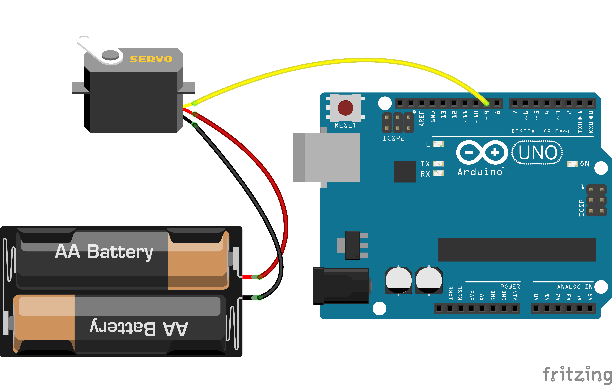
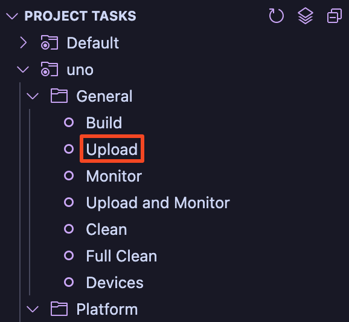

# Servo Motor Control via Serial Commands

This code allows you to control a servo motor connected to an Arduino Uno by typing a position (0–180) in a serial terminal.
It uses PlatformIO and the Arduino framework inside Visual Studio Code.

## Hardware Requirements

- **Arduino Uno** board
- **Servo motor**
- **USB A-to-B** cable​ for programming and power
- **Jumper wires**

## Software Requirements

- **Visual Studio Code** (VS Code)
- **PlatformIO IDE** extension for VS Code

## Wiring Diagram

   

| Servo Wire | Connects To         | Arduino Pin/Power        |
| ---------- | ------------------- | ------------------------ |
| Signal     | PWM capable I/O pin | D9                       |
| VCC        | Power               | 5V (or external supply)  |
| GND        | Ground              | GND (or external ground) |

> [!NOTE]
> For best performance and to avoid potential damage to your Arduino, it is recommended to power the servo from an external supply rather than the Arduino 5V pin,
> especially for larger or high-torque servos.

## Installation & Setup

Follow these steps to get up and running:

1. **Install VS Code**

   - Download from the [official VS Code website](https://code.visualstudio.com/) and install.

2. **Install PlatformIO IDE and Serial Monitor**

   - Open VS Code, go to **Extensions** in the side menu bar.
   - Search for **PlatformIO IDE** and **Serial Monitor**. Install both extensions.
   - Detailed instructions can be found [here](https://platformio.org/install/ide?install=vscode).

3. **Open This Project Folder**

   - Download or `git clone` this repository.
   - In VS Code, select **File → Open Folder...** and choose the project root (this folder).

4. **Connect Your Arduino**

   - Plug the Arduino Uno into your computer via USB.

5. **Build and Upload**

   

   - Click the **PlatformIO Home** icon (left sidebar) → **Project Tasks** → **uno** → **General** → **Upload**.
   - PlatformIO will compile the code and upload to the board.

6. **Open Serial Monitor**

   

   - In VS Code panel (`Ctrl + J` to open), click the **Serial Monitor**.
   - Ensure **Baud Rate** is set to **9600** and proper port is selected.

7. **Control the Servo**
   - When prompted "Enter position:", type a number between **0** and **180**, then press **Enter**.
   - The servo will move to that angle and print back the position.

## How It Works (Brief)

- `setup()` initializes serial communication at 9600 baud and attaches the servo to pin D9.
- `loop()` asks you to enter a position, reads your input, and if it’s between 0–180, moves the servo.
- Invalid values will produce an error message in the serial console.

## Troubleshooting

- **No serial output**: Confirm baud rate is set to **9600** in the Serial Monitor.
- **Very slow loading**: It's a normal thing. Initial loading takes some time because PlatformIO needs to install required dependencies.
